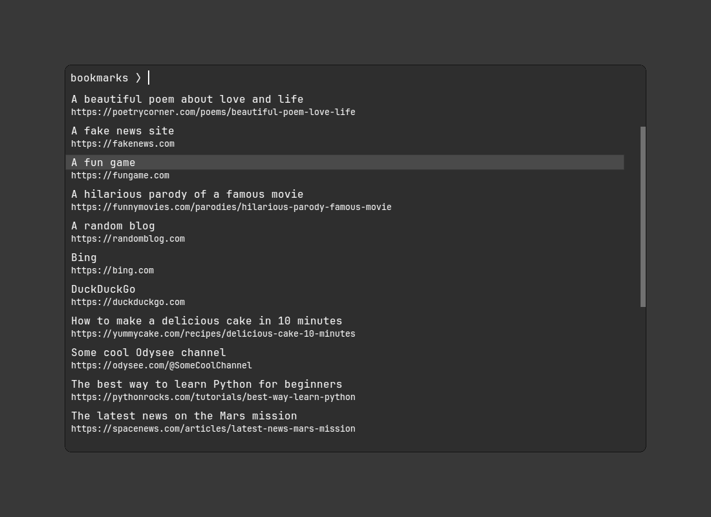

# my-bookmarks.pl

A simple script to manage bookmarks in a text file and display them using rofi.



## Bookmarks format

The bookmark file uses the following format:

```text
# This is a comment
DuckDuckGo
: https://duckduckgo.com

Some cool Odysee channel
: https://odysee.com/@SomeCoolChannel

# Comments are only allowed in lines of their own
# if you follow a bookmark title or URL with a comment
# it will be considered part of the bookmark

Also    we   don't really care  about
   : https://leading.trailing/or/interior/whitespace

   # It works just fine.
```

## Requirements

- Perl, naturally.
- [`rofi`](https://github.com/davatorium/rofi)
- [`notify-send`](https://man.archlinux.org/man/notify-send.1.en)

## License

Copyright © 2023 André Kugland. Licensed under the [MIT license](LICENSE).
